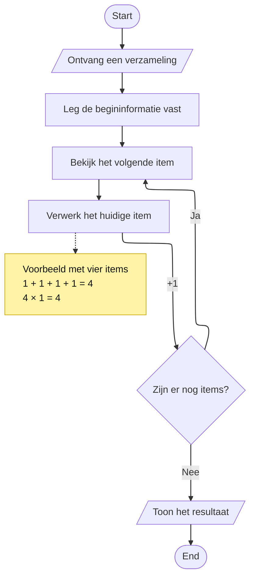

### Herhaalde bewerkingen

Bij **Bewerkingen tellen** zagen we dat je kunt onderzoeken hoe vaak een gekozen bewerking tijdens een algoritme wordt uitgevoerd.

Wanneer een algoritme een verzameling systematisch verwerkt, kan dezelfde bewerking voor ieder item opnieuw plaatsvinden.

### Herhaling in een algoritme

Bekijk de volgende algemene verwerking:



De flowchart beschrijft **wat het algoritme doet**.

Na het verwerken van een item loopt de flow terug wanneer er nog items over zijn. Daardoor wordt de stap **Verwerk het huidige item** opnieuw uitgevoerd.

De `+1` bij de pijl is geen extra stap van het algoritme. Het is een **wiskundige annotatie**: iedere keer dat het huidige item wordt verwerkt, tellen we één uitvoering van die bewerking.

### Een concrete uitvoering volgen

Stel dat de verzameling vier items bevat:

```text
A, B, C, D
```

Ieder item wordt één keer verwerkt.

Met een Trace Table kun je volgen hoe het aantal uitgevoerde verwerkingen oploopt:

| Stap | Huidig item | Verwerking | Aantal verwerkingen |
| ---: | --- | ---: | ---: |
| 0 | — | — | 0 |
| 1 | A | +1 | 1 |
| 2 | B | +1 | 2 |
| 3 | C | +1 | 3 |
| 4 | D | +1 | 4 |

Dezelfde bewerking is in deze uitvoering vier keer uitgevoerd.

Dat kun je schrijven als:

$$
1 + 1 + 1 + 1 = 4
$$

Omdat iedere uitvoering één keer telt, kun je dezelfde berekening ook korter schrijven:

$$
4 \times 1 = 4
$$

### Van proces naar hoeveelheid werk

De flowchart en de Trace Table laten hetzelfde proces op verschillende manieren zien:

- de **flowchart** maakt zichtbaar waar de herhaling in het algoritme plaatsvindt;
- de **`+1`-annotatie** geeft aan welke uitvoering wordt geteld;
- de **Trace Table** laat zien hoe het aantal uitvoeringen tijdens een concrete verwerking oploopt;
- de **berekening** vat het totale aantal uitvoeringen samen.

Zo kun je een algoritme niet alleen beschrijven aan de hand van wat het doet, maar ook onderzoeken **hoeveel keer een bepaalde bewerking tijdens de uitvoering plaatsvindt**.
