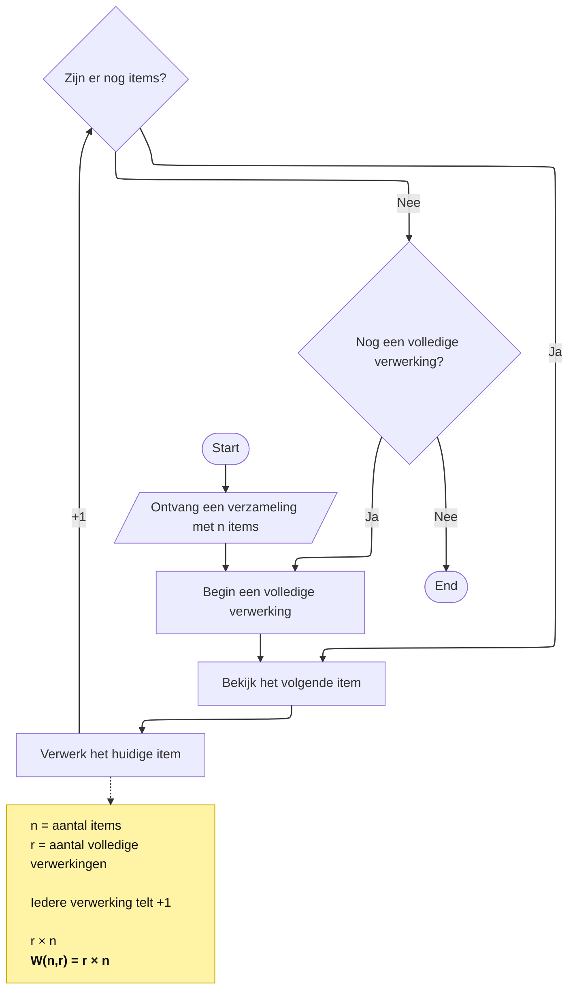

### Aantal bewerkingen bij herhaling

Bij **Herhaalde verwerking met n** heb je gezien dat een volledige verwerking van `n` items meerdere keren kan worden uitgevoerd.

Als één volledige verwerking `n` getelde bewerkingen bevat, dan geldt bijvoorbeeld:

$$
n + n + n = 3n
$$

Hier is `3` het aantal keer dat de volledige verwerking wordt uitgevoerd.

Om ook dat aantal algemeen te kunnen beschrijven, gebruiken we de letter **r**.

#### Wat betekenen n en r?

We gebruiken nu twee waarden:

- **$n$** = het aantal items dat wordt verwerkt;
- **$r$** = het aantal keer dat de volledige verwerking wordt herhaald.

Als één volledige verwerking van `n` items uit `n` getelde bewerkingen bestaat, dan krijg je bij `r` volledige verwerkingen:

$$
\underbrace{n + n + \ldots + n}_{r\text{ keer}}
$$

Dat kunnen we korter schrijven als:

$$
r \times n
$$

#### De hoeveelheid werk beschrijven

Net als eerder gebruiken we **W** voor *work*: de hoeveelheid werk die we meten door een gekozen bewerking te tellen.

Omdat de hoeveelheid werk nu afhangt van zowel `n` als `r`, schrijven we:

$$
W(n,r)
$$

Daarbij betekent:

$$
W(n,r) = \text{het aantal getelde bewerkingen bij } n \text{ items en } r \text{ volledige verwerkingen}
$$

Voor het algemene voorbeeld waarin ieder item tijdens iedere volledige verwerking precies één keer de gekozen bewerking veroorzaakt:

$$
W(n,r) = r \times n
$$

Bijvoorbeeld, als:

$$
n = 4
$$

en:

$$
r = 3
$$

dan geldt:

$$
W(4,3) = 3 \times 4 = 12
$$

De gekozen bewerking wordt dan twaalf keer uitgevoerd.

#### Herhaling in het algoritme

De volgende flowchart laat zien dat er twee niveaus van herhaling kunnen zijn.

De binnenste herhaling verwerkt de items van de verzameling.

Pas wanneer alle items zijn verwerkt, is één volledige verwerking klaar. Daarna kan het algoritme besluiten om de volledige verwerking opnieuw uit te voeren.

De `+1` geeft opnieuw aan welke bewerking we tellen.

De wiskundige beschrijving vat beide niveaus van herhaling samen:

$$
W(n,r) = r \times n
$$

#### Een formule controleren

Neem een verzameling met vijf items die twee keer volledig wordt verwerkt.

Dan is:

$$
n = 5
$$

en:

$$
r = 2
$$

De formule voorspelt:

$$
W(5,2) = 2 \times 5 = 10
$$

Je kunt dat ook als herhaalde optelling schrijven:

$$
5 + 5 = 10
$$

Een concrete uitvoering moet dan tien uitvoeringen van de gekozen bewerking opleveren.

Zo kun je vanuit het algoritmische proces onderzoeken hoe de hoeveelheid werk afhangt van zowel **de hoeveelheid gegevens** als **het aantal herhalingen**.