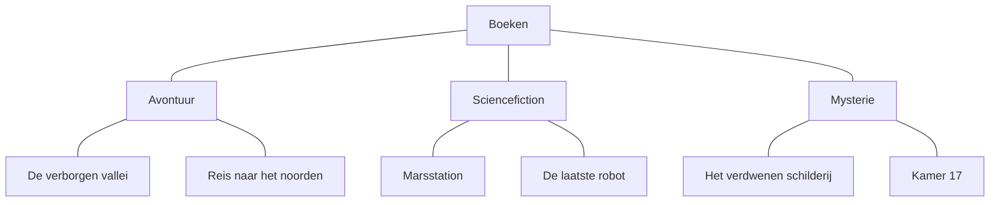
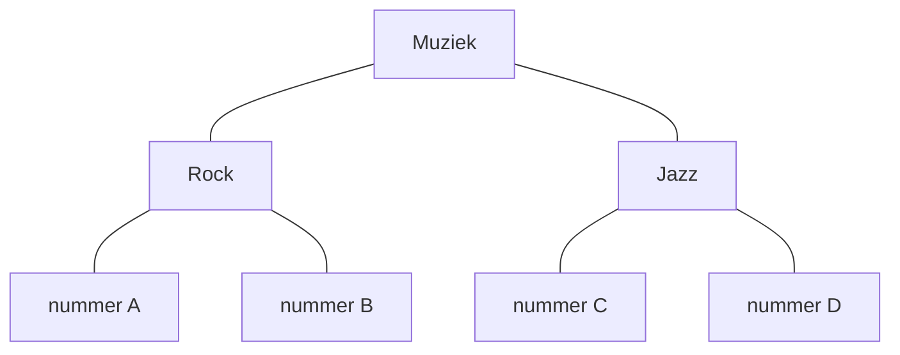
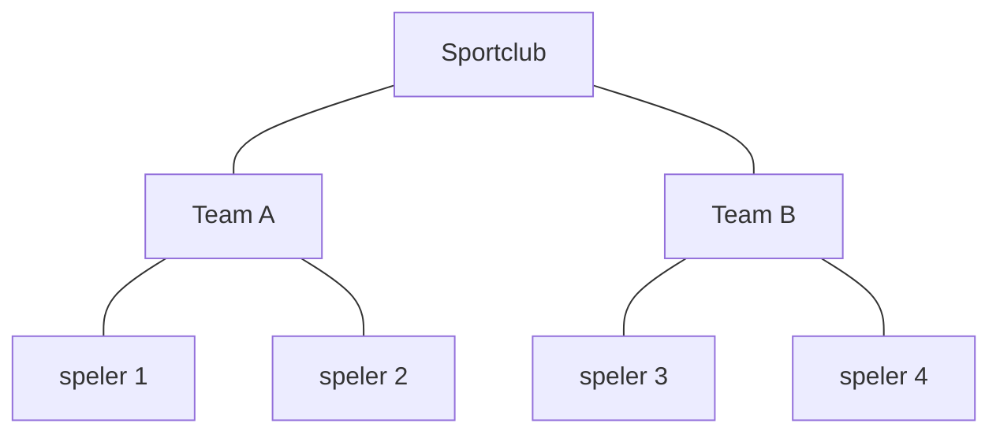

### Datastructuurdiagram

Een programma kan meerdere gegevens tegelijk gebruiken.

Wanneer gegevens bij elkaar horen, helpt het om zichtbaar te maken **hoe deze gegevens zijn georganiseerd**.

Daarvoor kun je een **datastructuurdiagram** gebruiken.

Een datastructuurdiagram laat zien:

* welke gegevens worden opgeslagen;
* welke gegevens bij elkaar horen;
* hoe gegevens zijn gegroepeerd;
* welke relaties er tussen gegevens bestaan.

Het diagram beschrijft de **structuur van de gegevens**, niet de stappen die een programma uitvoert.

Een datastructuurdiagram is geen vaste soort diagram. Het gaat erom dat je zichtbaar maakt **hoe gegevens zijn georganiseerd en met elkaar samenhangen**.

### Gegevens groeperen

Gegevens kunnen bij elkaar horen omdat ze iets gemeenschappelijks hebben.

Stel dat een bibliotheek boeken indeelt op genre.

Een eenvoudige structuur kan bijvoorbeeld zijn:

Het datastructuurdiagram maakt hier de structuur van de gegevens zichtbaar.

`Boeken` vormt de verzameling. Daarbinnen zijn de gegevens gegroepeerd in verschillende genres. Binnen ieder genre staan de boeken die bij die groep horen.

### Structuur en gegevens

In een datastructuurdiagram kun je onderscheid maken tussen de **structuur** en de gegevens die daarin worden opgeslagen.

Bijvoorbeeld:

`Rock` en `Jazz` geven aan **hoe de gegevens zijn gegroepeerd**.

De nummers zijn de **gegevens binnen die groepen**.

Nieuwe gegevens kunnen aan een bestaande groep worden toegevoegd zonder dat de hele structuur hoeft te veranderen.

### Gegevens terugvinden

Een goede datastructuur helpt niet alleen bij het opslaan van gegevens.

De structuur moet ook duidelijk maken **waar je gegevens kunt terugvinden**.

Bijvoorbeeld:

In het diagram kun je zien:

* welke teams er zijn;
* welke spelers bij een team horen;
* waar een bepaalde speler binnen de structuur is opgeslagen.

De manier waarop gegevens worden georganiseerd bepaalt daarmee ook hoe je ze later kunt terugvinden.

### Dezelfde gegevens, een andere structuur

Dezelfde gegevens kunnen vaak op verschillende manieren worden georganiseerd.

Een verzameling films zou bijvoorbeeld kunnen worden gegroepeerd op:

* genre;
* jaar;
* regisseur;
* leeftijdscategorie.

Er bestaat daarom niet automatisch één juiste datastructuur.

Welke structuur bruikbaar is, hangt af van **wat je met de gegevens wilt kunnen doen**.

### Van probleem naar datastructuurdiagram

Wanneer je een datastructuurdiagram maakt, denk je na over:

* welke gegevens relevant zijn;
* welke gegevens bij elkaar horen;
* welke groepen nodig zijn;
* hoe gegevens binnen die groepen worden georganiseerd;
* hoe nieuwe gegevens kunnen worden toegevoegd;
* hoe opgeslagen gegevens later kunnen worden teruggevonden.

Controleer je diagram door te proberen verschillende gegevens toe te voegen en weer terug te vinden.

### Van datastructuurdiagram naar code

Een datastructuurdiagram beschrijft eerst **hoe gegevens logisch zijn georganiseerd**.

Het schrijft nog niet voor hoe die structuur in Python moet worden gemaakt.

Een structuur waarin meerdere gegevens bij elkaar worden bewaard, kan later bijvoorbeeld met een Python `list` worden uitgewerkt.

Het datastructuurdiagram helpt je daarmee eerst na te denken over **welke gegevens je nodig hebt en hoe deze samenhangen**, voordat je beslist hoe je deze in code opslaat.
