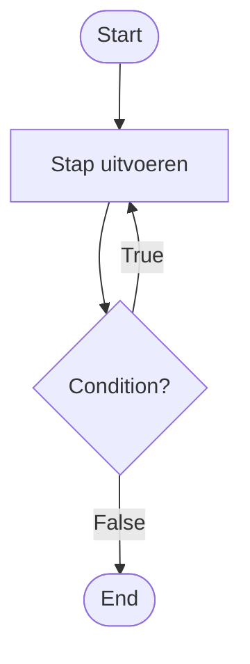

### While loops

Soms moet een algoritme een aantal stappen meerdere keren uitvoeren.

In een flowchart kan de flow dan teruggaan naar een eerdere stap.

De route die teruggaat zorgt ervoor dat een deel van het algoritme opnieuw wordt uitgevoerd.

### Herhaling met `while`

Een `while`-loop herhaalt stappen zolang een **condition** `True` is.

De condition wordt gecontroleerd voordat de stappen opnieuw worden uitgevoerd.

Zolang de condition `True` is, gaat de flow terug naar het begin van de herhaling.

Wanneer de condition `False` is, gaat de flow verder.

### Toestand verandert

Bij iedere herhaling kan de **toestand** van het systeem veranderen.

Bijvoorbeeld:

- een teller kan veranderen;
- een resterend bedrag kan kleiner worden;
- nieuwe informatie kan worden verwerkt.

De verandering van de toestand kan ervoor zorgen dat de condition uiteindelijk `False` wordt.

### Stoppen van de herhaling

Een `while`-loop moet uiteindelijk kunnen stoppen.

Daarvoor moet de toestand tijdens het proces kunnen veranderen, zodat de condition niet voor altijd `True` blijft.

### Van probleem naar flowchart

Wanneer een probleem een `while`-loop nodig heeft, bepaal je:

- welke stappen worden herhaald;
- welke condition bepaalt of de stappen opnieuw worden uitgevoerd;
- welke toestand tijdens iedere herhaling verandert;
- wanneer de condition `False` wordt.

Verbind daarna de flow zo dat de herhaalde stappen teruglopen naar het juiste punt in het algoritme.

Controleer je flowchart door meerdere keren de route door de herhaling te volgen.

Controleer ook of de flow uiteindelijk bij **End** kan uitkomen.

### Van flowchart naar Python

Een herhalende route in een flowchart kan worden vertaald naar een `while`-loop in Python.

Een `while`-loop voert stappen opnieuw uit zolang de condition `True` is.

De flowchart helpt daarbij om zichtbaar te maken:

- welke stappen worden herhaald;
- welke condition wordt gecontroleerd;
- wat er tijdens iedere herhaling verandert;
- en wanneer de herhaling stopt.
