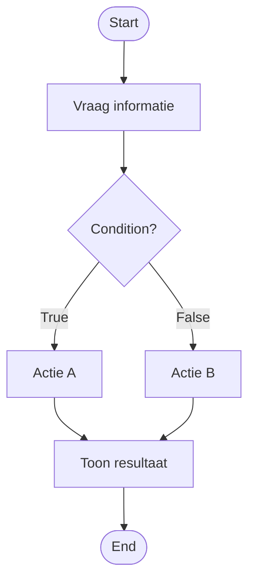

### Pseudocode

Pseudocode is een manier om de **logica van een oplossing** in duidelijke stappen op te schrijven voordat je deze programmeert.

Je gebruikt gewone taal. De stappen moeten zo duidelijk zijn dat je kunt zien **wat het programma moet doen**, zonder al Python-syntax te schrijven.

### Waarom pseudocode?

Een flowchart laat vooral goed zien:

- welke stappen er zijn;
- waar beslissingen worden genomen;
- welke routes door een algoritme mogelijk zijn.

Pseudocode beschrijft dezelfde oplossing als een **geordende reeks instructies**.

De beweging wordt daardoor:

```text
probleem
↓
flowchart
↓
pseudocode
↓
Python
```

Pseudocode helpt je dus om de stap van een visueel ontwerp naar code kleiner te maken.

### Eén logische actie per stap

Een pseudocodestap beschrijft bij voorkeur één logisch onderdeel van het algoritme.

Niet:

```text
1. Vraag een getal, controleer het en toon daarna de juiste reactie.
```

Wel:

```text
1. Vraag een getal
2. Controleer het getal
3. Toon de juiste reactie
```

Daardoor kun je later per stap bepalen welke code nodig is.

### Nummer de stappen

Geef de hoofdstappen een nummer:

```text
1. Vraag de benodigde informatie
2. Controleer de situatie
3. Toon het resultaat
```

Een nummer maakt het makkelijker om over een algoritme te praten.

Je kunt bijvoorbeeld zeggen:

> Bij stap 2 neemt mijn programma nog niet de juiste beslissing.

Dezelfde stapnummers kunnen later ook helpen bij testen en debugging.

### Beslissingen beschrijven

Soms hangt een volgende stap af van een **condition**.

In pseudocode kun je zo'n beslissing in natuurlijke taal beschrijven:

```text
1. Vraag de benodigde informatie

2. Controleer de situatie
   2.1 Als de condition waar is, voer actie A uit
   2.2 Anders, voer actie B uit

3. Toon het resultaat
```

De subnummers laten zien dat stap `2.1` en stap `2.2` bij dezelfde grotere stap horen.

### Inspringing maakt structuur zichtbaar

Gebruik inspringing om zichtbaar te maken welke stappen binnen een beslissing horen.

Bijvoorbeeld:

```text
1. Vergelijk twee waarden

2. Bepaal de uitkomst
   2.1 Als de eerste waarde groter is, toon uitkomst A
   2.2 Anders, toon uitkomst B
```

Zonder inspringing is minder duidelijk welke acties bij de beslissing horen.

### Van flowchart naar pseudocode

Een flowchart en pseudocode kunnen **dezelfde oplossing op twee verschillende manieren** weergeven.

Een flowchart kan bijvoorbeeld deze structuur laten zien:



Dezelfde logica kan als pseudocode worden geschreven:

```text
1. Vraag de benodigde informatie

2. Controleer de condition
   2.1 Als de condition waar is, voer actie A uit
   2.2 Anders, voer actie B uit

3. Toon het resultaat
```

De flowchart maakt vooral de **routes** zichtbaar.

De pseudocode maakt vooral de **volgorde en bedoeling van de stappen** zichtbaar.

### Pseudocode is geen Python

Pseudocode beschrijft **wat er moet gebeuren**. Je hoeft nog niet te weten welke Python-syntax daarvoor nodig is.

Dus liever:

```text
2. Controleer welke situatie geldt
   2.1 Als situatie A geldt, voer actie A uit
   2.2 Anders, voer actie B uit
```

dan:

```text
2. Gebruik if voor situatie A
2.1 Gebruik else voor de andere situatie
```

In het tweede voorbeeld wordt de Python-oplossing al voorgeschreven. Dat is niet de bedoeling van pseudocode.

### Pseudocode als comments in Python

Je kunt pseudocode direct als comments in een `.py`-bestand schrijven.

Eerst staat er bijvoorbeeld alleen:

```python
# 1. Vraag de benodigde informatie

# 2. Controleer welke situatie geldt
#    2.1 Als situatie A geldt, voer actie A uit
#    2.2 Anders, voer actie B uit

# 3. Toon het resultaat
```

Daarna bouw je de Python-code **bij je eigen stappen**.

De pseudocode hoeft niet verwijderd te worden wanneer het programma werkt. Als de comments de bedoeling van de code beschrijven, blijven ze nuttige documentatie van je oplossing.

### Goede pseudocode

Controleer je pseudocode voordat je gaat programmeren:

- beschrijft iedere stap één logisch onderdeel;
- staan de stappen in een logische volgorde;
- zijn de stappen genummerd;
- zijn onderdelen van beslissingen ingesprongen en waar nodig voorzien van subnummers;
- beschrijft de pseudocode wat er moet gebeuren zonder Python-syntax voor te schrijven;
- kun je vanuit de pseudocode uitleggen hoe jouw oplossing werkt?
