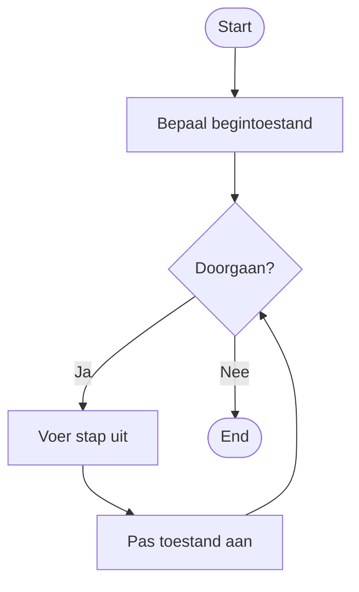

### Pseudocode en herhaling

In Week 3 heb je pseudocode gebruikt om stappen en beslissingen van een algoritme te beschrijven.

Soms wordt een stap niet één keer uitgevoerd, maar **steeds opnieuw**.

Ook dat kun je in pseudocode zichtbaar maken.

### Herhalende stappen beschrijven

Bij een herhaling beschrijf je eerst **wanneer het proces moet doorgaan**.

Daaronder plaats je de stappen die telkens opnieuw worden uitgevoerd.

Bijvoorbeeld:

```text
1. Bepaal de beginsituatie

2. Herhaal zolang het doel nog niet is bereikt
   2.1 Voer de volgende stap uit
   2.2 Pas de toestand aan

3. Toon het resultaat
```

Stap `2.1` en `2.2` horen bij de herhaling. Daarom staan ze ingesprongen onder stap `2`.

Wanneer stap `2.2` is uitgevoerd, wordt opnieuw bekeken of de herhaling nog een keer nodig is.

### Wat wordt herhaald?

Een herhaling bestaat meestal uit meerdere stappen die samen één cyclus vormen.

Bijvoorbeeld:

```text
1. Bepaal hoeveel werk er nog gedaan moet worden

2. Herhaal zolang er werk over is
   2.1 Kies het volgende onderdeel
   2.2 Verwerk het onderdeel
   2.3 Pas aan hoeveel werk nog over is

3. Toon het resultaat
```

Niet één losse regel, maar de hele groep `2.1` tot en met `2.3` wordt steeds opnieuw uitgevoerd.

De inspringing maakt zichtbaar **welke stappen bij de herhaling horen**.

### De toestand moet veranderen

Een herhalend proces kan alleen vooruitgaan wanneer er tijdens de herhaling iets verandert.

Dat noemen we de **toestand** van het systeem.

Dat kan bijvoorbeeld zijn:

- hoeveel werk nog over is;
- hoeveel pogingen zijn gedaan;
- welk bedrag nog verwerkt moet worden;
- welke invoer op dat moment wordt gecontroleerd.

In pseudocode moet die verandering zichtbaar zijn:

```text
1. Bepaal de begintoestand

2. Herhaal zolang het doel nog niet is bereikt
   2.1 Voer een stap uit
   2.2 Pas de toestand aan
```

Als de toestand niet verandert, kan dezelfde situatie steeds opnieuw ontstaan en stopt het algoritme misschien nooit.

### Doorgaan en stoppen

Bij iedere herhaling moet duidelijk zijn:

- **wanneer het proces doorgaat**;
- **wanneer het proces klaar is**.

Je kunt dat bijvoorbeeld formuleren als:

```text
2. Herhaal zolang er nog werk over is
```

De **doorgaanvoorwaarde** is dan:

```text
er is nog werk over
```

De bijbehorende stoptoestand is:

```text
er is geen werk meer over
```

Het is belangrijk dat de stappen binnen de herhaling de toestand uiteindelijk naar die stoptoestand kunnen veranderen.

### Beslissingen binnen een herhaling

Binnen een herhaling kunnen ook beslissingen nodig zijn.

Bijvoorbeeld:

```text
1. Bepaal de beginsituatie

2. Herhaal zolang het doel nog niet is bereikt
   2.1 Controleer de huidige situatie

       2.1.1 Als situatie A geldt, voer actie A uit
       2.1.2 Anders, voer actie B uit

   2.2 Pas de toestand aan

3. Toon het resultaat
```

Hier wordt tijdens iedere herhaling opnieuw een beslissing genomen.

De nummering en inspringing laten zien dat de beslissing onderdeel is van de herhalende stap.

### Van flowchart naar pseudocode

Een loop in een flowchart kan bijvoorbeeld deze structuur hebben:



Dezelfde structuur kan als pseudocode worden geschreven:

```text
1. Bepaal de begintoestand

2. Herhaal zolang de doorgaanvoorwaarde geldt
   2.1 Voer de stap uit
   2.2 Pas de toestand aan

3. Stop
```

De flowchart maakt vooral zichtbaar **dat de route terugloopt**.

De pseudocode maakt zichtbaar **welke groep stappen opnieuw wordt uitgevoerd en waarom**.

### Van pseudocode naar een herhalend programma

Pseudocode blijft de beschrijving van **wat het algoritme moet doen**.

Eerst kun je bijvoorbeeld in je `.py`-bestand schrijven:

```python
# 1. Bepaal de begintoestand

# 2. Herhaal zolang het doel nog niet is bereikt
#    2.1 Voer de volgende stap uit
#    2.2 Pas de toestand aan

# 3. Toon het resultaat
```

Daarna bouw je de Python-code bij deze stappen.

De herhalende groep uit je pseudocode wordt daarbij de groep code die tijdens iedere herhaling opnieuw wordt uitgevoerd.

### Controleer je herhaling

Loop je pseudocode een paar keer zelf door.

Controleer daarbij:

- is duidelijk welke stappen worden herhaald;
- is duidelijk wanneer de herhaling doorgaat;
- verandert de toestand tijdens iedere herhaling;
- kan daardoor uiteindelijk de stoptoestand worden bereikt;
- staan alle stappen die bij de herhaling horen duidelijk ingesprongen;
- beschrijft de pseudocode nog steeds **wat** er moet gebeuren en niet welke Python-syntax je moet gebruiken?
