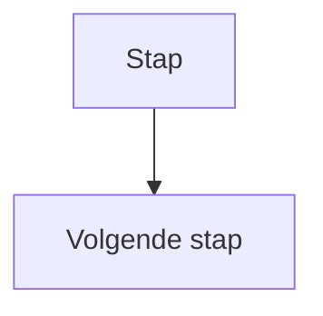
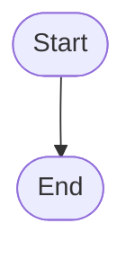
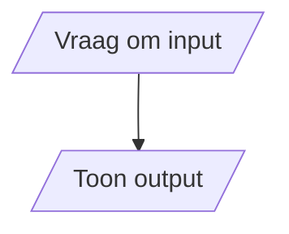
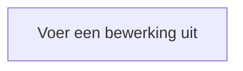

### Flowcharts

Voordat je een oplossing programmeert, kun je eerst zichtbaar maken **welke stappen** nodig zijn.

Een **flowchart** is een visuele weergave van de stappen waaruit een algoritme bestaat en de volgorde waarin deze worden uitgevoerd.

Een flowchart helpt je om eerst na te denken over de structuur van een oplossing, voordat je deze vertaalt naar code.

### Flow

Een flowchart wordt van stap naar stap gevolgd.

Pijlen geven aan welke stap daarna wordt uitgevoerd. Dit noemen we de **flow**.

### Start en End

Een flowchart heeft een duidelijk begin en einde.

De afgeronde vorm wordt gebruikt voor het begin en einde van een algoritme.

### Input en output

Wanneer een programma informatie ontvangt of toont, gebruik je een **input/output**-symbool.

**Input** is informatie die het programma ontvangt.

**Output** is informatie die het programma aan de gebruiker toont.

### Process

Een bewerking of instructie wordt weergegeven met een **process**.

Een process verandert de flow niet. Nadat de instructie is uitgevoerd, gaat het algoritme verder naar de volgende stap.

### Van probleem naar flowchart

Begin niet meteen met het tekenen van symbolen.

Bepaal eerst:

- welke **input** het systeem nodig heeft;
- welke stappen of bewerkingen moeten worden uitgevoerd;
- welke **output** het systeem moet geven.

Zet deze onderdelen daarna in een logische volgorde en verbind ze met pijlen.

Controleer vervolgens je flowchart door de stappen vanaf **Start** te volgen.

De flow moet uiteindelijk bij **End** uitkomen.

### Van flowchart naar code

Een flowchart beschrijft de structuur van je oplossing voordat deze in een programmeertaal is geschreven.

De verschillende onderdelen kunnen later worden vertaald naar Python:

- input/output → bijvoorbeeld `input()` en `print()`;
- process → een instructie of bewerking.

Een flowchart is daarmee geen Python-code, maar een manier om de **logica van een algoritme zichtbaar te maken** voordat je gaat programmeren.