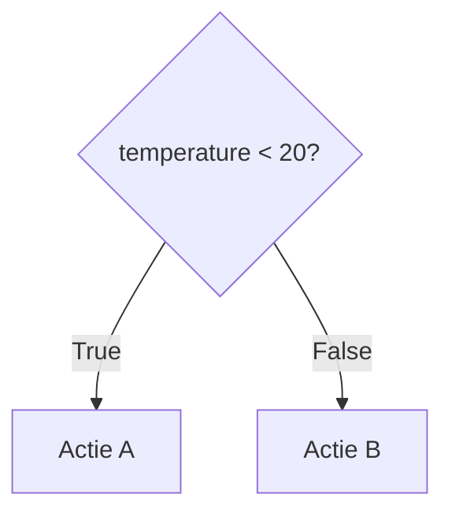
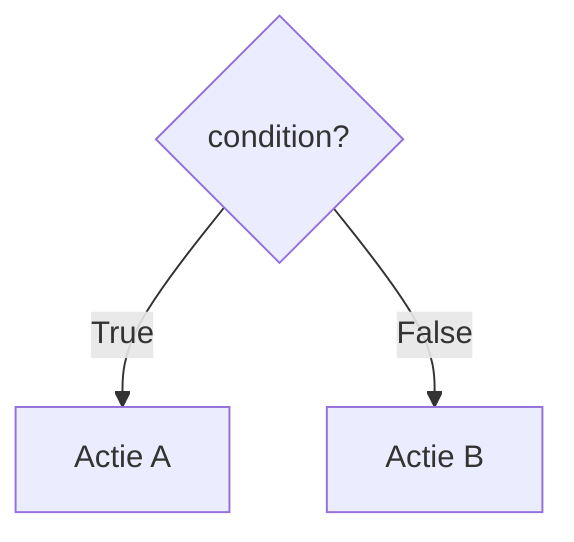
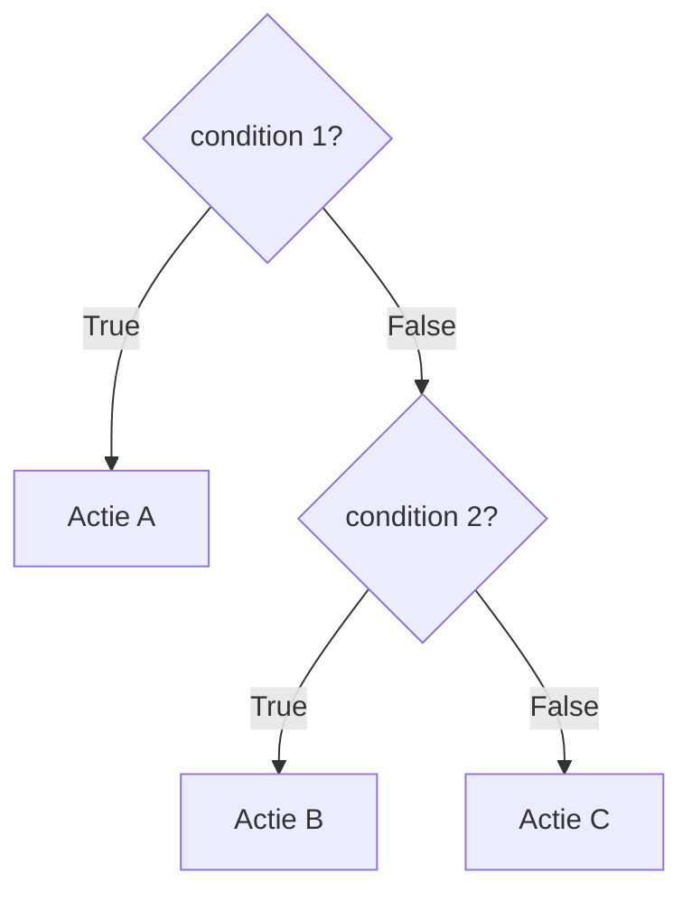

### Decisions

Soms hangt de volgende stap in een flowchart af van een **condition**.

Daarvoor gebruik je een **decision**.

In de decision staat een condition die als `True` of `False` kan worden geëvalueerd.

Een decision zorgt ervoor dat de flow zich kan **vertakken**.

### Branches

De mogelijke routes die vanuit een decision ontstaan, noemen we **branches**.

Bij een Boolean condition zijn er twee mogelijke uitkomsten:

- `True`
- `False`

Iedere branch kan naar een andere volgende stap leiden.

### Meerdere decisions

Een algoritme kan meerdere decisions bevatten.

Na een decision kan bijvoorbeeld opnieuw een decision nodig zijn:

Welke decisions nodig zijn en in welke volgorde ze moeten worden uitgevoerd, hangt af van het probleem dat je probeert op te lossen.

### Van probleem naar flowchart

Wanneer een probleem verschillende mogelijke routes bevat, bepaal je:

- welke **input** het systeem nodig heeft;
- welke **conditions** gecontroleerd moeten worden;
- welke **branches** uit die decisions ontstaan;
- welke stappen binnen iedere route worden uitgevoerd;
- welke **output** bij iedere mogelijke route hoort.

Controleer vervolgens je flowchart door verschillende mogelijke inputs vanaf **Start** te volgen.

Voor iedere mogelijke situatie moet er een route zijn die bij de juiste output en uiteindelijk bij **End** uitkomt.

### Van flowchart naar code

Een decision in een flowchart beschrijft een keuze in de flow van het algoritme.

Bij het vertalen naar Python kunnen:

- decisions worden uitgedrukt met conditions;
- branches worden uitgedrukt als verschillende mogelijke routes door het programma.

Welke conditions en branches nodig zijn, hangt af van het probleem dat je probeert op te lossen.
