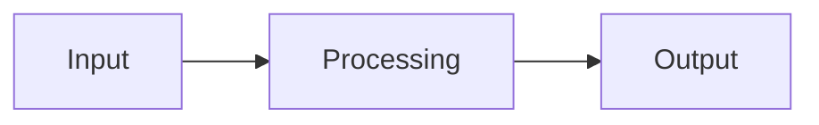
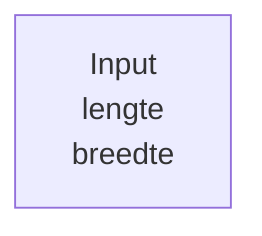
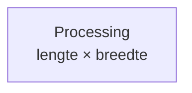
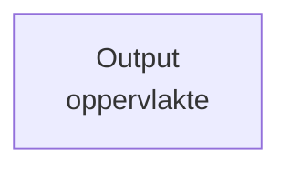
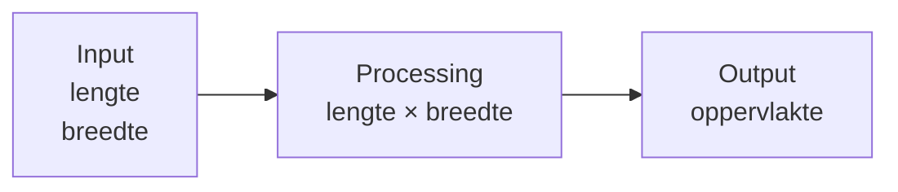
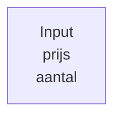
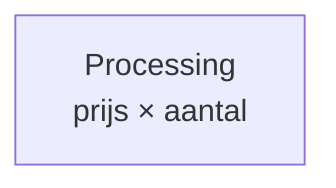
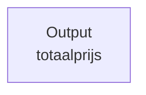
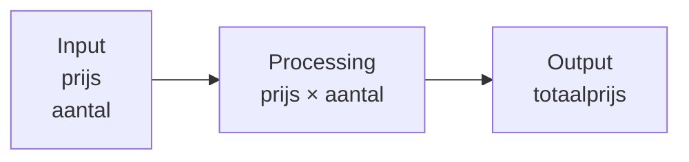

### IPO-diagram

Een programma ontvangt vaak informatie, doet iets met die informatie en levert daarna nieuwe informatie op.

Deze informatiestroom kun je zichtbaar maken met een **IPO-diagram**.

**IPO** staat voor:

- **Input** — informatie die het systeem binnenkomt;
- **Processing** — wat het systeem met deze informatie doet;
- **Output** — informatie die het systeem oplevert.

Een IPO-diagram beschrijft dus:

### Input

**Input** is de informatie die een systeem nodig heeft om zijn taak uit te voeren.

Bijvoorbeeld: een programma berekent de oppervlakte van een rechthoek.

Daarvoor zijn twee gegevens nodig:

- lengte;
- breedte.

In een IPO-diagram kan dat worden weergegeven als:

Input beschrijft de **informatie** die het systeem binnenkomt. Het beschrijft nog niet hoe deze informatie in Python wordt opgeslagen.

### Processing

**Processing** beschrijft wat er met de input moet gebeuren om de gewenste informatie te krijgen.

Voor het berekenen van de oppervlakte is dat:

Processing kan uit meerdere berekeningen bestaan.

Soms kan het resultaat van een berekening nodig zijn voor een volgende berekening. De volgorde binnen de verwerking kan dan belangrijk zijn.

### Output

**Output** is de informatie die het systeem na de verwerking oplevert.

In het voorbeeld is dat:

Het volledige IPO-diagram wordt daarmee:

### Gegeven of berekend?

Een belangrijk verschil in een IPO-diagram is het verschil tussen informatie die het systeem **krijgt** en informatie die het systeem **berekent**.

Stel dat een programma een totaalprijs berekent.

Het programma krijgt:

De totaalprijs hoeft dan niet ook als input te worden gegeven.

Deze kan worden berekend:

en wordt vervolgens output:

Het IPO-diagram maakt daarmee zichtbaar waar informatie vandaan komt:

Door Input, Processing en Output van elkaar te onderscheiden, kun je eerst de **informatiestroom** van een oplossing modelleren voordat je deze in programmacode uitwerkt.
