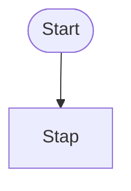

# PDF / Render Contract — Module 01

<!--
============================================================
DOEL VAN DIT CONTRACT
============================================================

Dit document legt de afspraken vast voor het renderen van dezelfde
onderwijsinhoud naar verschillende uitvoervormen:

1. website;
2. losse PSET- of TSET-PDF;
3. complete Module-PDF;
4. Understanding-PDF.

Het doel is dat onderwijsinhoud slechts één keer wordt onderhouden,
terwijl de presentatie per medium mag verschillen.

Dit contract beschrijft dus NIET de inhoud van een specifieke week,
Thinking Set, Problem Set of Understanding, maar de regels voor
hergebruik en rendering.
-->


## 1. Uitgangspunt: één bron, meerdere uitvoervormen

Onderwijsinhoud wordt zo veel mogelijk één keer opgeslagen.

De renderer bepaalt vervolgens hoe die inhoud wordt aangeboden in:

- de website;
- een losse PSET-PDF;
- een losse TSET-PDF;
- de complete Module-PDF;
- de Understanding-PDF.

Er worden geen aparte inhoudsversies onderhouden voor web en PDF
wanneer alleen de presentatie verschilt.


## 2. Functie van de uitvoervormen

### Website

De website is de interactieve hoofdvorm.

De website mag gebruikmaken van:

- interne links;
- uitklapbare hints;
- embedded video;
- embedded demo's;
- interactieve elementen;
- directe Understanding-includes;
- webnavigatie.


### Losse PSET- of TSET-PDF

Een losse PDF moet zelfstandig bruikbaar zijn.

Daarom bevat deze waar nodig ook de relevante Understanding-content.

Een leerling moet een losse PSET- of TSET-PDF kunnen gebruiken zonder
eerst een tweede document te moeten openen voor noodzakelijke uitleg.


### Complete Module-PDF

De complete Module-PDF bevat de volledige module als samenhangend
document.

Understanding-content wordt daarin niet telkens opnieuw bij iedere
PSET of TSET afgedrukt.

Wanneer een PSET of TSET Understanding nodig heeft, wordt in de
Module-PDF verwezen naar de betreffende Understanding-pagina of het
betreffende paginabereik.


### Understanding-PDF

De Understanding-PDF bevat de volledige kennisbank in een logische,
doorlopende volgorde.

Deze PDF vormt de bron voor paginaverwijzingen vanuit de Module-PDF.


## 3. Renderingmatrix

| Onderdeel | Website | Losse PSET/TSET-PDF | Module-PDF |
|---|---|---|---|
| Titel | tonen | tonen | tonen |
| Badges | tonen | tonen | tonen |
| Leerdoelen | tonen | tonen | tonen |
| Probleem/context | tonen | tonen | tonen |
| Demo | embed | QR-code | QR-code |
| Video | embed | QR-code | QR-code |
| Mermaid-diagram | gegenereerde PNG | gegenereerde PNG | gegenereerde PNG |
| Understanding | inline | inline | verwijzing |
| Opdracht | tonen | tonen | tonen |
| Hints | uitklapbaar | zichtbaar | zichtbaar |
| Testen | tonen | tonen | tonen |
| Inleveren | tonen | tonen | tonen |
| Webnavigatie | tonen | niet tonen | niet tonen |


## 4. Understanding-verwijzingen

PSETs en TSETs verwijzen inhoudelijk naar Understanding-concepten,
niet naar vaste paginanummers.

Gebruik daarvoor stabiele concept-ID's, bijvoorbeeld:

    python.conditions
    python.if
    python.elif
    visual-first.ipo
    visual-first.flowcharts.basics

De presentatie bepaalt daarna de uitvoervorm.

Voorbeeld:

Website:

    /understanding/python/conditions/

Losse PSET/TSET-PDF:

    volledige Understanding-content opnemen

Module-PDF:

    Zie Understanding — Conditions, p. 27

Paginanummers worden NOOIT handmatig in een PSET of TSET geschreven.


## 5. Paginanummers en cross-references

Paginanummers worden centraal beheerd.

Voorkeursrichting:

    Understanding bouwen
            ↓
    beginpagina per Understanding-ID bepalen
            ↓
    gegenereerde cross-reference-data
            ↓
    Module-PDF renderen

Een gegenereerd YAML-bestand kan bijvoorbeeld bevatten:

```yaml
understanding:
  python.conditions:
    title: Conditions
    page: 27

  python.if:
    title: if
    page: 29

  visual-first.flowcharts.basics:
    title: Flowcharts — Basics
    page: 46
```

Wanneer automatische paginadetectie nog niet beschikbaar is, mag deze
YAML tijdelijk handmatig worden onderhouden.

De PSET- en TSET-bronnen blijven daarvan onafhankelijk.


## 6. Multimedia

Multimedia wordt via een stabiele ID opgenomen.

Voorbeelden:

    demo.jellybeans-less
    video.conditionals

De concrete URL staat centraal in data, niet verspreid door meerdere
onderwijsbestanden.

Bijvoorbeeld:

```yaml
media:
  demo.jellybeans-less:
    type: asciinema
    url: https://...

  video.conditionals:
    type: youtube
    url: https://...
```

Rendering:

Website:

- YouTube → embedded video;
- asciinema → embedded terminaldemo;
- andere ondersteunde media → passende embed.

PDF:

- QR-code;
- korte omschrijving;
- eventueel zichtbare korte URL wanneer dat functioneel is.

De QR-code verwijst naar dezelfde URL als de web-embed.


## 6A. Mermaid en gegenereerde diagrammen

Mermaid-broncode blijft onderdeel van de Markdown en is de
source of truth voor het diagram.

Ieder Mermaid-blok bevat direct na de opening een stabiele ID:



De ID bepaalt rechtstreeks de bestandsnaam:

    guess-the-number-01.png

Gebruik voor IDs:

- lowercase letters;
- cijfers;
- koppeltekens;
- een herkenbare inhoudelijke naam;
- een volgnummer `-01`, `-02`, enzovoort.

Er zijn twee assetcategorieën:

    build/assets/mermaid/sets/
    build/assets/mermaid/understanding/

TSET- en PSET-diagrammen worden opgeslagen onder `sets`.

Understanding-diagrammen worden opgeslagen onder `understanding`.

Less en More vormen GEEN afzonderlijke Mermaid-categorie. Wanneer
Less en More exact hetzelfde diagram gebruiken, mogen zij bewust
dezelfde Mermaid-ID gebruiken en daarmee dezelfde PNG delen.

Dezelfde Mermaid-ID mag binnen één categorie nooit naar verschillende
Mermaid-broncode verwijzen. De build moet in dat geval stoppen met
een duidelijke foutmelding.

De Markdown bevat GEEN handmatige verwijzing naar de gegenereerde
PNG. De renderpipeline:

    leest Mermaid-bron + ID
        ↓
    genereert / overschrijft de PNG
        ↓
    vervangt het Mermaid-blok in de uitvoervorm door de afbeelding

Dezelfde gegenereerde PNG wordt gebruikt voor web en PDF. Hierdoor
is de weergave niet afhankelijk van Mermaid-rendering in de browser
en blijft de visuele output tussen uitvoervormen gelijk.

De gegenereerde PNG is build-output en wordt niet als afzonderlijke
onderwijsbron onderhouden.


## 7. Demo's

Een demo laat zien WAT het gewenste product of programma doet.

Een demo laat niet zien HOE de oplossing is gebouwd wanneer dat het
probleemoplossen van de leerling zou overnemen.

Demo's worden pas definitief gemaakt wanneer de gewenste solution en
het gewenste gedrag vaststaan.

De inhoud van de PSET of TSET mag niet afhankelijk worden van een
specifieke embed-techniek.


## 8. Video

Video ondersteunt uitleg of demonstratie, maar vervangt noodzakelijke
geschreven instructie niet.

Een leerling moet uit de tekst nog steeds kunnen begrijpen wat van hem
of haar wordt verwacht.

Video is aanvullende ondersteuning.

Website:

    embed

PDF:

    QR-code + titel / korte omschrijving


## 9. Hints

Hints blijven onderdeel van de onderwijsinhoud.

Website:

- hints zijn uitklapbaar;
- de leerling kiest bewust welke hint wordt geopend.

PDF:

- hints mogen volledig worden opgenomen;
- zij worden duidelijk als HINT gemarkeerd;
- de volgorde en inhoud blijven gelijk aan de webversie.

Er wordt geen aparte inhoudelijke hintversie voor PDF onderhouden.


## 10. Thinking Sets en productieve worsteling

Een TSET blijft een thinking task, ongeacht het medium.

De PDF-rendering mag daarom geen extra uitleg, Understanding of
oplossingsstructuur vóór de thinking task plaatsen wanneer dit de
productieve worsteling vermindert.

De kernregels blijven:

- korte launch;
- geen strategie-uitleg;
- geen voorgeschreven representatie tenzij die onderdeel van de task is;
- meerdere instappunten;
- context, constraints en doel;
- geen spoilers of stappenplan voor de oplossing.

Web en PDF mogen visueel verschillen, maar niet didactisch van functie.


## 11. Problem Sets

Een PSET moet in iedere uitvoervorm dezelfde probleemstructuur behouden.

Typische onderdelen zijn:

- titel;
- badges;
- leerdoelen;
- probleem;
- demo;
- Understanding;
- opdracht;
- specificatie;
- hints;
- testen;
- inleveren.

Niet iedere PSET hoeft exact dezelfde tussenkoppen te hebben wanneer de
inhoud daar niet om vraagt.

De broninhoud blijft leidend; de renderer verandert presentatie, geen
didactische betekenis.


## 12. Weekpagina's

Weekpagina's hebben primair een organiserende functie.

Zij verbinden:

- de weekvraag;
- Thinking Set;
- klassikale activiteiten;
- Problem Set;
- Understanding;
- planning / deadlines.

Een weekpagina hoeft daarom niet automatisch dezelfde interne
architectuur te krijgen als Understanding, PSET of TSET.

Voor PDF-generatie wordt later afzonderlijk bepaald welke onderdelen
van de weekpagina in de Module-PDF thuishoren.


## 13. Web-only presentatie

Onderstaande elementen zijn presentatie en worden niet letterlijk naar
PDF gekopieerd:

- webnavigatie;
- hover-effecten;
- open/dicht-status van details;
- embedded players;
- interactieve controls;
- localhost- of site-URL's als primaire navigatiemethode.

De onderliggende inhoud of functie blijft wel beschikbaar via een
PDF-passende vorm.


## 14. PDF-only presentatie

PDF mag specifieke presentatie-elementen toevoegen zonder een tweede
inhoudsbron te creëren.

Voorbeelden:

- QR-codes;
- paginanummers;
- "Zie Understanding, p. …";
- printvriendelijke hintkaders;
- page breaks;
- kop- en voetteksten;
- inhoudsopgave;
- interne PDF-links.


## 15. Geen duplicatie van onderwijsinhoud

Maak geen bestanden zoals:

    jellybeans-web.md
    jellybeans-pdf.md

wanneer het inhoudelijke verschil alleen door het medium ontstaat.

Gebruik één bron en laat de renderer beslissen hoe onderdelen worden
weergegeven.


## 16. Data buiten de onderwijsinhoud

Veranderlijke of presentatie-afhankelijke gegevens worden waar mogelijk
centraal opgeslagen.

Voorbeelden:

- deadlines;
- Understanding-paginanummers;
- multimedia-URL's;
- QR-doelen;
- eventueel documentmetadata.

Dit sluit aan op de bestaande werkwijze waarbij data zoals deadlines
via YAML in pagina's kan worden ingevoegd.


## 17. Volgorde van implementatie

De PDF-architectuur wordt stapsgewijs ingevoerd.

1. PSET 3 — Jellybeans Less als referentie-PSET.
2. TSET 3 — Guess the Number als referentie-TSET.
3. PSET- en TSET-contracten definitief maken.
4. Overige bestaande PSETs en TSETs migreren.
5. Weekpagina's afzonderlijk analyseren.
6. Multimedia-ID's en media-YAML invoeren.
7. Understanding-cross-references en paginanummers invoeren.
8. Losse PDF-rendering testen.
9. Complete Module-PDF samenstellen.
10. Demo's als laatste toevoegen wanneer solutions definitief zijn.


## 18. Ontwerpcontrole

Controleer bij iedere wijziging:

- [ ] Is er nog steeds één inhoudsbron?
- [ ] Werkt de inhoud op de website?
- [ ] Kan dezelfde inhoud in een losse PDF worden gebruikt?
- [ ] Kan dezelfde inhoud zonder duplicatie in de Module-PDF worden gebruikt?
- [ ] Wordt Understanding in een losse PSET/TSET-PDF inline opgenomen?
- [ ] Wordt Understanding in de Module-PDF via een cross-reference weergegeven?
- [ ] Zijn paginanummers niet hardcoded in onderwijsinhoud?
- [ ] Wordt multimedia op web embedded en in PDF via QR aangeboden?
- [ ] Blijven hints inhoudelijk identiek?
- [ ] Blijft een TSET productieve worsteling ondersteunen?
- [ ] Worden web-only presentatie-elementen niet als inhoud behandeld?
- [ ] Zijn toekomstige PDF-specifieke keuzes in renderer/data geplaatst in plaats van in dubbele onderwijsbestanden?
