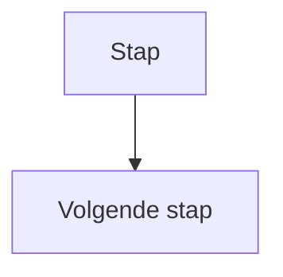

<!--
============================================================
UNDERSTANDING — VISUAL FIRST CONTENT — ONTWERPCONTRACT
============================================================

DOEL VAN DEZE TEMPLATE
----------------------
Deze template legt het gerealiseerde didactische ontwerp vast
van de inhoud van een Visual First Understanding.

Dit bestand staat in:

    docs/understanding/_content/visual-first/[PAD]/[BESTAND].md

Het bevat de daadwerkelijke, herbruikbare onderwijsinhoud
over een Visual First-representatie.

Dezelfde content kan:

1. via een zelfstandige Understanding-pagina worden geopend;

2. vanuit een Thinking Set als naslagwerk worden gebruikt;

3. waar passend binnen een andere modulepagina worden
   geïntegreerd.

Daarom bevat dit bestand GEEN:

- frontmatter;
- H1-paginatitel;
- template-instelling;
- weeknummer;
- PSET-nummer;
- TSET-specifieke oplossing.


============================================================
1. BELANGRIJKE REGEL VOOR DEZE TEMPLATE
============================================================

Visual First Understanding legt uit HOE een representatie
werkt.

De content bepaalt NIET voor de leerling hoe een concreet
probleem met die representatie moet worden opgelost.

De representatie is gereedschap voor denken.

De leerling moet dat gereedschap vervolgens zelf gebruiken.


============================================================
2. ONDERWIJSINHOUDELIJKE HIËRARCHIE
============================================================

Gebruik altijd deze volgorde:

1. MODULEFRAMEWORK
   Bepaalt welke Visual First-representatie wordt gebruikt,
   wanneer deze in de leerlijn voorkomt en welke functie zij
   heeft.

2. CONCEPTUELE LEERLIJN
   Bepaalt welke representatiekennis leerlingen al hebben en
   welke nieuwe kennis nodig is.

3. VISUAL FIRST CONTENT-TEMPLATE
   Bepaalt hoe de representatie didactisch wordt uitgelegd.

4. EERDERE UNDERSTANDING-CONTENT
   Is referentie voor stijl, niveau en vorm, maar nooit bron
   voor nieuwe onderwijsinhoud.

Bij een inhoudelijk conflict is het MODULEFRAMEWORK leidend.


============================================================
3. FUNCTIE VAN VISUAL FIRST UNDERSTANDING
============================================================

Visual First Understanding beantwoordt vooral:

    "Hoe kan ik mijn denken met deze representatie zichtbaar
    maken?"

De content ondersteunt leerlingen bij:

- structureren;
- representeren;
- redeneren;
- controleren;
- communiceren over een oplossing.

De Understanding is GEEN:

- Thinking Task;
- PSET;
- stappenplan voor één specifieke oplossing;
- kant-en-klare representatie van een opdracht;
- Python-theorieles.


============================================================
4. SOURCE OF TRUTH — MODULEFRAMEWORK
============================================================

Bepaal vóór het schrijven:

- welke representatie centraal staat;
- waarom deze representatie in de leerlijn wordt gebruikt;
- wat leerlingen ermee moeten kunnen uitdrukken;
- welke onderdelen/symbolen noodzakelijk zijn;
- welke onderdelen op dit moment nog niet nodig zijn;
- welke voorkennis beschikbaar is;
- hoe de representatie zich verhoudt tot Formulating the
  Problem en Expressing the Solution.

Vraag:

    "Wat moeten leerlingen NU over deze representatie
    begrijpen om haar zelfstandig te kunnen gebruiken?"

Niet:

    "Wat bestaat er allemaal binnen deze representatietaal?"


============================================================
5. ONTWERPANALYSE VÓÓR HET SCHRIJVEN
============================================================

Bepaal eerst:

FUNCTIE
- Welk soort denken maakt deze representatie zichtbaar?
- Wat kan een leerling hiermee beter zien of onderzoeken dan
  alleen met code of gewone tekst?

ELEMENTEN
- Welke visuele onderdelen moeten leerlingen kennen?
- Wat betekent ieder onderdeel?
- Welke relaties tussen onderdelen zijn belangrijk?

OPBOUW
- Wat is de eenvoudigste vorm van de representatie?
- Welke uitbreiding volgt logisch daarna?
- Welke complexiteit is voor deze plaats in de leerlijn
  passend?

VOORBEELDEN
- Wat is het kleinste generieke voorbeeld?
- Kan het voorbeeld inhoudelijk losstaan van de actuele
  Thinking Set of Problem Set?
- Helpt het voorbeeld de representatietaal begrijpen zonder
  de oplossing voor te structureren?

TRANSFER
- Hoe gaat de leerling van probleem naar representatie?
- Hoe kan de representatie worden gecontroleerd?
- Hoe kan zij later naar code of een andere oplossingsvorm
  worden vertaald?

Schrijf pas daarna de content.


============================================================
6. REPRESENTATIE ALS DENKGEREEDSCHAP
============================================================

Begin waar passend met de FUNCTIE van de representatie.

Niet alleen:

    "Een flowchart bestaat uit symbolen."

Maar bijvoorbeeld:

    "Voordat je een oplossing programmeert, kun je eerst
    zichtbaar maken welke stappen en beslissingen nodig zijn."

De leerling moet begrijpen WAAROM de representatie wordt
gebruikt.

Visual First is geen tekenopdracht.

De representatie ondersteunt het ontwerpen en beredeneren van
een oplossing.


============================================================
7. GEEN VASTE UNIVERSELE SECTIESTRUCTUUR
============================================================

Niet iedere Visual First Understanding krijgt dezelfde
tussenkoppen.

De structuur volgt uit de representatie.

Een flowchart kan bijvoorbeeld vragen om:

- flow;
- start/end;
- input/output;
- process;
- decision;
- branches.

Een andere representatie kan totaal andere onderdelen hebben.

Forceer dus geen flowchart-structuur op:

- IPO;
- trace tables;
- pseudocode;
- datarepresentaties;
- programma-schetsen;
- andere Visual First-vormen.


============================================================
8. CONCEPTUELE OPBOUW
============================================================

Bouw de representatie van eenvoudig naar complex op.

Een mogelijke beweging is:

    doel van de representatie
              ↓
       eenvoudig element
              ↓
       relatie / verbinding
              ↓
       volgend element
              ↓
      eenvoudige structuur
              ↓
      complexere structuur
              ↓
    zelfstandig toepassen

Dit is een ontwerpprincipe, geen verplicht format.


============================================================
9. VISUELE ELEMENTEN INTRODUCEREN
============================================================

Introduceer alleen elementen die leerlingen op dit punt in
de leerlijn nodig hebben.

Maak per element duidelijk:

- hoe het eruitziet;
- wat het betekent;
- wanneer het wordt gebruikt.

Combineer visuele vorm en betekenis.

Leerlingen moeten niet alleen symbolen herkennen, maar
begrijpen welke functie ze in een model hebben.


============================================================
10. GENERIEKE VOORBEELDEN
============================================================

Voorbeelden zijn:

- klein;
- generiek;
- inhoudelijk neutraal;
- gericht op één aspect van de representatie.

Gebruik GEEN concrete structuur uit een actuele PSET of TSET
wanneer leerlingen die zelf moeten ontwerpen.

Bijvoorbeeld bij een flowchart:

WEL:



NIET:

een complete flowchart van het probleem dat leerlingen in
de Thinking Set zelf moeten oplossen.


============================================================
11. MERMAID
============================================================

Gebruik Mermaid wanneer dit een passende manier is om de
Visual First-representatie correct en consistent weer te
geven.

Voor flowcharts is Mermaid geschikt.

Ieder Mermaid-blok bevat direct na de opening een stabiele ID:

```mermaid
%% id: [HERKENBARE-NAAM]-01

flowchart TD
    [GENERIEK DIAGRAM]
```

Regels:

- gebruik lowercase letters, cijfers en koppeltekens;
- gebruik een herkenbare inhoudelijke naam;
- nummer meerdere diagrammen met -01, -02, enzovoort;
- de ID is de bestandsnaam zonder extensie;
- dezelfde ID mag nooit voor verschillende Mermaid-broncode
  worden gebruikt;
- de buildpipeline genereert:

      build/assets/mermaid/understanding/[MERMAID-ID].png

De `_content` verwijst NIET zelf naar de PNG.
De renderpipeline bepaalt hoe het diagram op web en in PDF
wordt weergegeven.

Mermaid is een WEERGAVEMIDDEL.

Het bepaalt niet welke Visual First-representatie in een week
wordt gebruikt.

Gebruik Mermaid dus niet automatisch voor iedere Visual
First Understanding.


============================================================
12. ÉÉN NIEUW VISUEEL CONCEPT TEGELIJK
============================================================

Wanneer een nieuw element wordt geïntroduceerd, houd het
voorbeeld zo eenvoudig mogelijk.

Bijvoorbeeld:

### Flow


Introduceer niet onmiddellijk:

- meerdere decisions;
- loops;
- veel branches;
- uitgebreide labels;

wanneer alleen het begrip flow wordt uitgelegd.

Complexiteit wordt geleidelijk opgebouwd.


============================================================
13. TERMINOLOGIE
============================================================

Gebruik de afgesproken vaktermen consequent.

Binnen de gerealiseerde flowchart-Understanding worden
bijvoorbeeld gebruikt:

- flow;
- input;
- output;
- process;
- decision;
- condition;
- branch;
- Start;
- End.

Gebruik deze termen consequent wanneer zij al onderdeel van
de leerlijn zijn.

Vertaal programmeer- en representatietermen niet telkens
opnieuw wanneer bewust voor Engelse terminologie is gekozen.


============================================================
14. RELATIE MET COMPUTATIONAL THINKING
============================================================

Visual First ondersteunt computationeel denken.

De content hoeft niet voortdurend expliciet de term
Computational Thinking te noemen.

Wel moet de representatie leerlingen helpen om bijvoorbeeld:

- relevante informatie zichtbaar te maken;
- een probleem te structureren;
- stappen te ordenen;
- beslissingen expliciet te maken;
- routes of toestanden te onderzoeken;
- een algoritmische oplossing te formuleren.

Welke CT-functie centraal staat, volgt uit het framework.


============================================================
15. FORMULATING THE PROBLEM
============================================================

Een Visual First-representatie kan helpen om een probleem
explicieter te formuleren.

Wanneer dit relevant is, kan de Understanding beschrijven
welke informatie eerst moet worden bepaald vóór het tekenen.

Bijvoorbeeld:

- welke input speelt een rol?
- welke situaties zijn mogelijk?
- welke relaties zijn relevant?

De Understanding geeft daarmee een DENKRICHTING.

Zij vult de antwoorden voor een concrete opdracht niet in.


============================================================
16. EXPRESSING THE SOLUTION
============================================================

Een Visual First-representatie kan worden gebruikt om een
oplossing expliciet uit te drukken.

Wanneer dit relevant is, maak duidelijk welke eigenschappen
de representatie moet hebben om door anderen gevolgd te
kunnen worden.

Bijvoorbeeld:

- duidelijke volgorde;
- expliciete beslissingen;
- zichtbare branches;
- herkenbare input/output;
- alle relevante routes beschreven.

De representatie wordt daarmee ook een communicatiemiddel.


============================================================
17. VAN PROBLEEM NAAR REPRESENTATIE
============================================================

Een Understanding mag algemene vragen geven die helpen om
een representatie te construeren.

Bijvoorbeeld:

    Bepaal eerst:

    - welke input nodig is;
    - welke stappen worden uitgevoerd;
    - welke decisions nodig zijn;
    - welke output bij routes hoort.

Dit mag alleen op GENERIEK niveau.

De Understanding mag niet voor een concrete PSET/TSET
invullen:

- welke input;
- welke conditions;
- welke branches;
- welke volgorde;

de leerling moet kiezen.


============================================================
18. REPRESENTATIE CONTROLEREN
============================================================

Leer leerlingen dat een representatie gecontroleerd kan
worden.

Bijvoorbeeld door:

- verschillende inputs te volgen;
- routes van begin tot einde te doorlopen;
- te controleren of iedere mogelijke situatie uitkomt;
- te controleren of elementen eenduidig zijn;
- een andere leerling de representatie te laten volgen.

Dit ondersteunt de langere leerlijn naar systematisch testen.


============================================================
19. VAN REPRESENTATIE NAAR CODE
============================================================

Wanneer de representatie bedoeld is als ontwerp vóór het
programmeren, mag de Understanding de ALGEMENE relatie met
code laten zien.

Bijvoorbeeld bij een flowchart:

- input/output → `input()` / `print()`;
- process → instructie of berekening;
- decision → condition;
- branches → mogelijke routes.

Dit is een conceptuele brug.

Geef GEEN volledige vertaling van een concrete opdracht naar
Python.


============================================================
20. REPRESENTATIE IS NIET DE CODE
============================================================

Maak waar nodig expliciet dat de Visual First-representatie
een model van de oplossing is.

Bijvoorbeeld:

    Een flowchart is geen Python-code, maar een manier om de
    logica van een algoritme zichtbaar te maken voordat je
    gaat programmeren.

Dit helpt leerlingen onderscheid maken tussen:

- probleem;
- ontwerp/model;
- implementatie.


============================================================
21. VOORTBOUWEN OP EERDERE VISUAL FIRST-KENNIS
============================================================

Herhaal een representatie niet volledig wanneer leerlingen
de basis al kennen.

Een latere Understanding kan voortbouwen op eerder behandelde
elementen.

Bijvoorbeeld:

- eerst eenvoudige flowcharts;
- later loops in flowcharts;
- later complexere algoritmes.

Herhaal alleen wat nodig is voor de nieuwe uitbreiding.


============================================================
22. GEEN PSET-SPECIFIEKE OPLOSSINGEN
============================================================

De content weet niet welke PSET haar gebruikt.

Schrijf daarom niet:

    "Voor Jellybeans teken je eerst..."

maar:

    "Bij een decision controleer je een condition..."

Zo blijft de Understanding herbruikbaar.


============================================================
23. EXTRA VOORZICHTIG BIJ TSETS
============================================================

Visual First Understanding kan vanuit een Thinking Set
bereikbaar zijn.

Dat vraagt extra voorzichtigheid.

Een TSET kan juist bedoeld zijn om leerlingen zelf:

- conditions te ontdekken;
- stappen te ordenen;
- branches te construeren;
- een oplossingsstructuur te ontwikkelen.

De Understanding mag dan wel uitleggen HOE een flowchart of
andere representatie werkt, maar niet WELKE flowchart zij
voor de challenge moeten maken.

De TSET bepaalt wanneer en hoe de link naar Understanding
wordt aangeboden.


============================================================
24. GEEN HINTS IN UNDERSTANDING
============================================================

Understanding legt de representatie uit.

Hints horen bij een specifieke opdracht.

Voeg daarom geen PSET-achtige uitklaphints of probleemhints
toe aan deze content.


============================================================
25. GEEN OEFENOPDRACHTEN AUTOMATISCH TOEVOEGEN
============================================================

De gerealiseerde Understanding is primair uitleg en naslag.

Voeg niet automatisch:

- oefenopgaven;
- mini-challenges;
- quizvragen;
- reflectievragen;

toe.

Het toepassen van de representatie gebeurt in TSET's en
PSET's.


============================================================
26. GEEN LEERDOELEN IN _CONTENT
============================================================

Plaats geen apart leerdoelenblok in Visual First `_content`.

De leerdoelen horen bij de onderwijscontext waarin de
representatie wordt toegepast.

De content begint direct inhoudelijk.


============================================================
27. EERSTE H3 EN GEEN H1 IN _CONTENT
============================================================

Gebruik geen:

    # [Titel]

De wrapper bevat de paginatitel.

Ieder `_content`-bestand begint direct met een inhoudelijke H3:

    ### [ONDERWERP]

Deze eerste H3 blijft ALTIJD in `_content` staan.

De zelfstandige Understanding-wrapper plaatst direct vóór de
include de marker:

    <div class="understanding-article-start"></div>

De Understanding-CSS verbergt daardoor alleen op de
zelfstandige Understanding-pagina de eerste H3.

Wanneer dezelfde `_content` vanuit een TSET wordt gebruikt,
in een PSET wordt opgenomen of later in een samengestelde PDF
terechtkomt, blijft die eerste H3 zichtbaar en geeft zij het
kennisdeel een duidelijke inhoudelijke kop.

Plaats de marker `understanding-article-start` NOOIT in
`_content`; die hoort uitsluitend in de wrapper.

Gebruik voor een logisch subonderdeel:

    #### [SUBONDERDEEL]


============================================================
28. BESTANDSENCODING
============================================================

Sla alle `_content`-bestanden op als:

    UTF-8 zonder BOM

Dit is een technische ontwerpregel.

Een UTF-8 BOM vóór de eerste `###` kan ervoor zorgen dat
Markdown die eerste regel niet als heading herkent. Daardoor
kan bijvoorbeeld letterlijk `### Decisions` op de pagina
verschijnen.

Controleer daarom bij automatisch genereren of herschrijven van
bestanden expliciet dat geen BOM wordt toegevoegd.


============================================================
29. LEESBAARHEID
============================================================

Visual First Understanding moet visueel én tekstueel rustig
blijven.

Gebruik:

- korte alinea's;
- duidelijke tussenkoppen;
- één nieuw element tegelijk;
- kleine diagrammen;
- voldoende ruimte tussen tekst en diagram;
- directe uitleg bij het diagram.

Vermijd:

- grote ingewikkelde schema's;
- meerdere nieuwe symbolen tegelijk zonder noodzaak;
- lange theoretische beschrijvingen;
- decoratieve diagrammen zonder didactische functie.


============================================================
30. REFERENTIE-ONTWERP
============================================================

De gerealiseerde flowchart-content vormt het eerste
referentievoorbeeld voor Visual First Understanding.

Daaruit volgen onder andere:

- eerst uitleggen waarom de representatie nuttig is;
- betekenis vóór complexiteit;
- één representatie-element tegelijk introduceren;
- kleine generieke Mermaid-voorbeelden;
- geleidelijke opbouw naar samengestelde structuren;
- terminologie expliciet maken;
- laten zien hoe de representatie gecontroleerd kan worden;
- afsluiten met de relatie tussen probleem, representatie en
  code wanneer dat functioneel is.

Flowcharts bepalen NIET automatisch de structuur van andere
Visual First Understandings.

Het MODULEFRAMEWORK blijft inhoudelijk leidend.
-->


<!--
============================================================
CONTENT
============================================================

Vanaf hier komt uitsluitend de daadwerkelijke
leerlingzichtbare Visual First Understanding-content.

GEEN frontmatter.
GEEN H1.

Begin direct met de representatie of het eerste inhoudelijk
noodzakelijke onderdeel.
-->


### [REPRESENTATIE]

[Introduceer kort wat deze representatie zichtbaar maakt en
waarom zij wordt gebruikt.]


<!--
============================================================
EERSTE CONCEPTUELE STAP
============================================================

Introduceer het eenvoudigste noodzakelijke onderdeel.

Gebruik een klein generiek diagram wanneer dat functioneel
is.
-->

### [EERSTE ELEMENT / CONCEPT]

[Uitleg.]

```mermaid
%% id: [HERKENBARE-NAAM]-01

[GENERIEK DIAGRAM]
```

[Leg uit wat het element betekent en wat zichtbaar wordt.]


<!--
============================================================
VOLGENDE STAPPEN
============================================================

Voeg alleen inhoudelijk noodzakelijke onderdelen toe.

Bouw van eenvoudig naar complex.

Bijvoorbeeld:

### [VOLGEND ELEMENT]

...

### [COMBINATIE VAN ELEMENTEN]

...

De representatie bepaalt de structuur.
============================================================
-->


<!--
============================================================
VAN PROBLEEM NAAR REPRESENTATIE — ALLEEN INDIEN FUNCTIONEEL
============================================================

Geef algemene denkvragen waarmee leerlingen zelfstandig een
representatie kunnen construeren.

Vul nooit een concrete opdracht voor hen in.
-->

### Van probleem naar [REPRESENTATIE]

Bepaal eerst:

- [...];
- [...];
- [...].

[Leg uit hoe deze informatie daarna in de representatie
zichtbaar kan worden gemaakt.]


<!--
============================================================
CONTROLEREN — ALLEEN INDIEN FUNCTIONEEL
============================================================

Laat zien hoe een representatie systematisch kan worden
doorgelopen of gecontroleerd.
-->

[Leg uit hoe leerlingen kunnen controleren of de
representatie compleet en logisch is.]


<!--
============================================================
VAN REPRESENTATIE NAAR CODE / ANDERE VORM
ALLEEN INDIEN DE LEERLIJN DIT VRAAGT
============================================================

Leg alleen de ALGEMENE relatie uit.
-->

### Van [REPRESENTATIE] naar code

[Beschrijf conceptueel hoe onderdelen van de representatie
terugkomen in code.]

[Benadruk dat de representatie een ontwerp/model is en niet
de code zelf.]


<!--
============================================================
LAATSTE ONTWERPCONTROLE
============================================================

FRAMEWORK EN SCOPE
------------------
[ ] Komt de representatie uit het moduleframework?
[ ] Klopt de functie van deze representatie in de leerlijn?
[ ] Worden alleen onderdelen behandeld die leerlingen nu
    nodig hebben?
[ ] Is toekomstige representatiekennis buiten de content
    gebleven?


FUNCTIE
-------
[ ] Wordt duidelijk WAAROM de representatie wordt gebruikt?
[ ] Ondersteunt de content daadwerkelijk denken en ontwerpen?
[ ] Is de representatie meer dan alleen een tekentaal?


OPBOUW
------
[ ] Wordt van eenvoudig naar complex opgebouwd?
[ ] Wordt één nieuw element tegelijk geïntroduceerd?
[ ] Is de volgorde inhoudelijk logisch?
[ ] Is geen flowchart-structuur kunstmatig op een andere
    representatie toegepast?


TERMINOLOGIE
------------
[ ] Worden afgesproken vaktermen consequent gebruikt?
[ ] Worden nieuwe termen expliciet geïntroduceerd?
[ ] Is de betekenis van visuele elementen duidelijk?


DIAGRAMMEN
----------
[ ] Is ieder diagram functioneel?
[ ] Is ieder diagram klein genoeg?
[ ] Is ieder diagram generiek?
[ ] Geeft geen diagram een actuele PSET/TSET-oplossing weg?
[ ] Is Mermaid alleen gebruikt wanneer passend?
[ ] Heeft ieder Mermaid-blok een stabiele `%% id:`?
[ ] Werkt de Mermaid-syntax?


PROBLEEMOPLOSSEN
----------------
[ ] Legt de content het representatiegereedschap uit?
[ ] Blijven probleemspecifieke keuzes bij de leerling?
[ ] Zijn geen concrete conditions, branches, stappen of
    andere oplossingsonderdelen ingevuld?


TSET
----
[ ] Kan de content vanuit een Thinking Set worden geopend
    zonder de Thinking Task op te lossen?
[ ] Is de representatievorm duidelijk zonder de challenge te
    structureren?
[ ] Blijft productieve worsteling mogelijk?


PSET
----
[ ] Is de content herbruikbaar in verschillende PSET's?
[ ] Is geen concrete PSET benoemd?
[ ] Ondersteunt de content ontwerp vóór implementatie?


CONTROLEREN
-----------
[ ] Wordt waar relevant uitgelegd hoe een representatie kan
    worden doorgelopen?
[ ] Is controle gekoppeld aan de logica van de representatie?
[ ] Bereidt dit waar passend voor op systematisch testen?


REPRESENTATIE → CODE
--------------------
[ ] Wordt alleen een algemene conceptuele brug gelegd?
[ ] Wordt geen concrete opdracht vertaald?
[ ] Is duidelijk dat representatie en code verschillende
    lagen zijn?


STRUCTUUR
--------
[ ] Staat er geen frontmatter in _content?
[ ] Staat er geen H1?
[ ] Begint het bestand direct met een inhoudelijke H3 (`###`)?
[ ] Is de eerste H3 in _content behouden en niet naar de wrapper verplaatst?
[ ] Staat er geen `understanding-article-start` marker in _content?
[ ] Is het bestand UTF-8 zonder BOM?
[ ] Zijn alleen inhoudelijk noodzakelijke headings gebruikt?
[ ] Zijn geen leerdoelen toegevoegd?
[ ] Zijn geen hints toegevoegd?
[ ] Zijn geen automatische oefeningen toegevoegd?


LEESBAARHEID
------------
[ ] Zijn alinea's kort en functioneel?
[ ] Zijn diagrammen overzichtelijk?
[ ] Staat uitleg direct bij het relevante diagram?
[ ] Is onnodige complexiteit verwijderd?


REFERENTIE-ONTWERP
------------------
[ ] Sluit de stijl aan op het gerealiseerde Visual First
    ontwerp?
[ ] Is geen nieuwe leerlingzichtbare paginastructuur bedacht?
[ ] Is het ontwerp van andere representaties niet automatisch
    gelijkgemaakt aan flowcharts?


EINDCONTROLE
------------
[ ] Zijn alle placeholders verwijderd?
[ ] Werken alle diagrammen?
[ ] Werken eventuele links?
[ ] Verwijst hergebruik naar `understanding/_content/visual-first/[PAD]/[BESTAND].md`?
[ ] Kan het bestand zowel zelfstandig via een wrapper als
    waar nodig via een include worden gebruikt?
[ ] Helpt de content leerlingen de representatie zelfstandig
    te gebruiken zonder het probleem voor hen op te lossen?
============================================================
-->